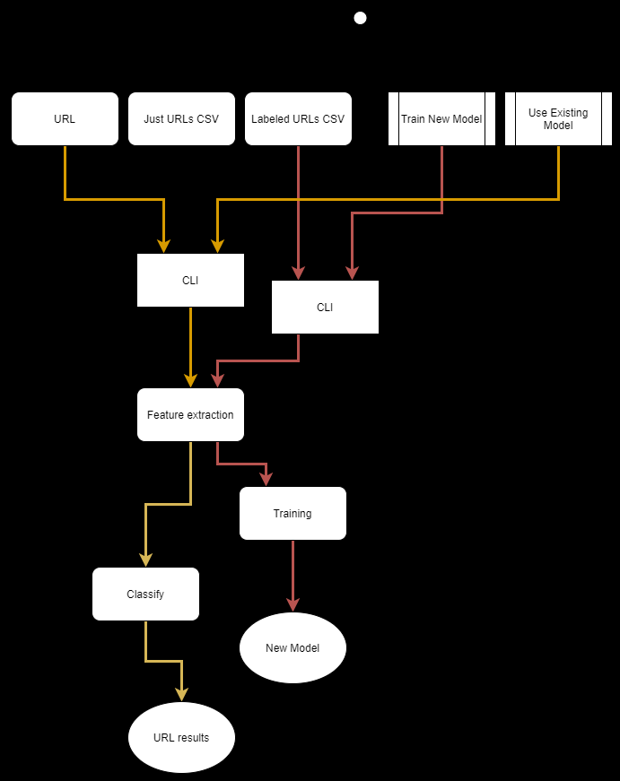

# Certitude

Certitude is a python package to perform supervised malicious URL classification using a joint set of lexicographic and certificate features (if available).
Certitude requires `whois`, which may not be available on some systems, and is thus distributed as a docker image.
If `whois` is available it can also be installed as a python package, see the development section below.

```bash
# pull image from registry
docker pull registry.gitlab.com/cossas/certitude:latest

# print help
docker run -it registry.gitlab.com/cossas/certitude:latest

# example perform training from data in local directory
docker run -it -v $(pwd)/tests/data:/data registry.gitlab.com/cossas/certitude:latest --train /data/newmodel -d /data/testset_labeled.csv

# example performing classification of a url with the trained model
docker run -it -v $(pwd)/tests/data:/data registry.gitlab.com/cossas/certitude:latest --model /data/newmodel --url https://tno.nl

```

## Demo & Test

To see some useful commands and to test the code you can check the makefile:

```bash
make demo
```

## Code flow



## Development

To start developing this package, follow these steps:

- Start WSL
- `git clone` this project, ensuring you do that in the WSL filesystem. Run `cd` to
ensure you're in the WSL home directory
- `cd` into the just cloned directory
- Run `code .` to start VS Code
- In a VS Code terminal, run `poetry install`, `poetry shell` and finally
`poetry run pre-commit install`
